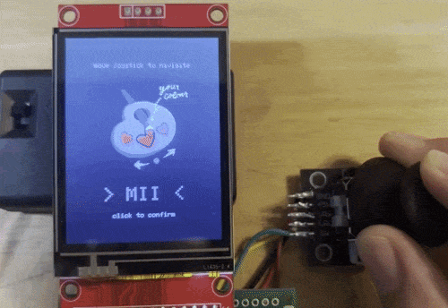
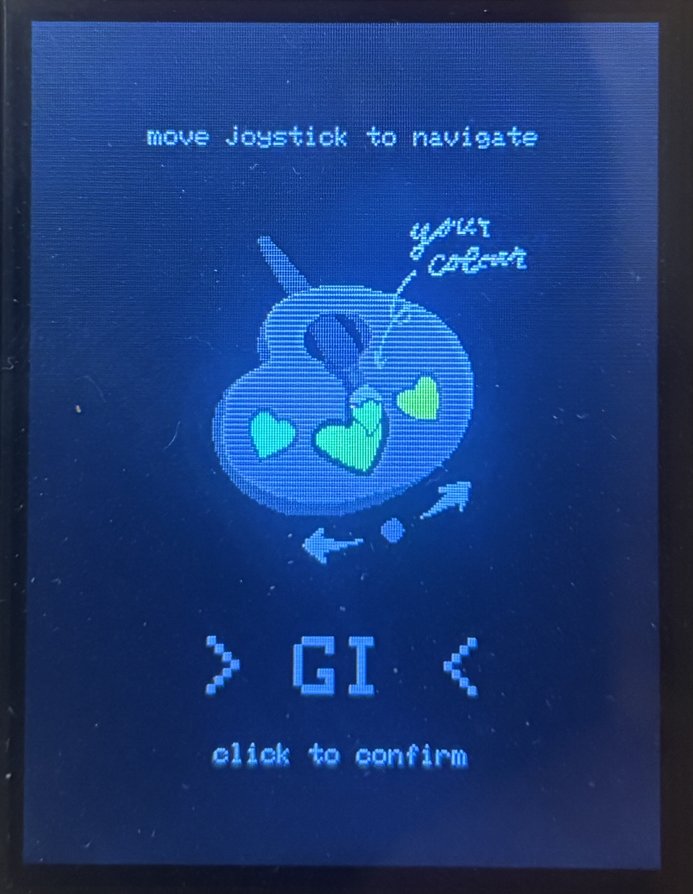
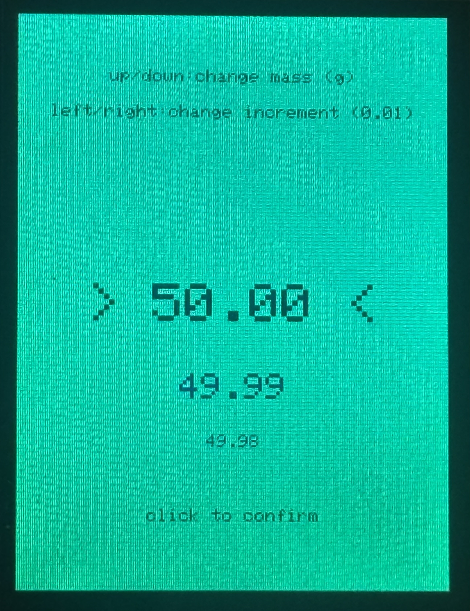
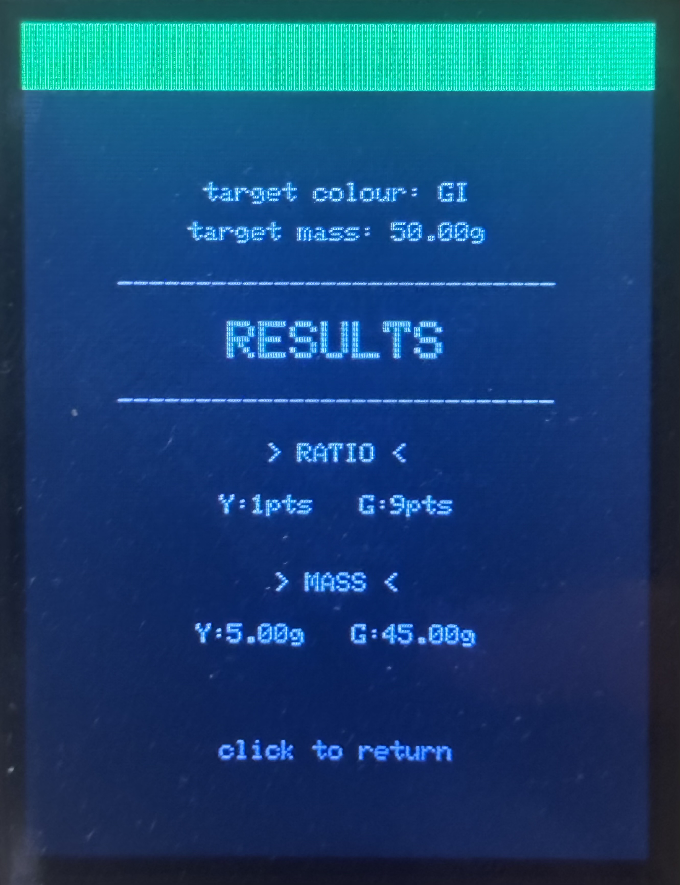
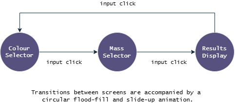
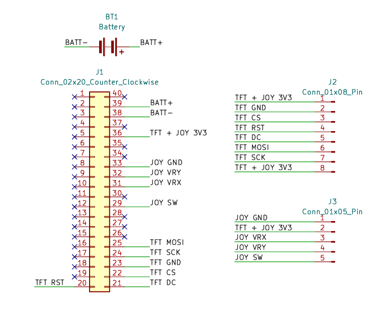

# Digital Color Palette

  

### Screens

<table>
  <tr>
    <td></td>
    <td></td>
    <td></td>
  </tr>
</table>

## **Executive Summary**

This device allows the user to select for desired hue, value, and mass, then displays the exact clay mixing formula (ratio and grams) using the onboard screen. Built on a Raspberry Pi Pico with a 2.4" SPI TFT display and analog joystick, soldered onto perfboard and battery-powered.

### **Hardware Used:**
- Raspberry Pi Pico
- 2.4" ILI9341 TFT SPI display w/MSP2402 breakout, 240x320
- KY-023 dual-axis joystick
- 3x AAA battery pack w/switch
- 40x60mm perfboard

> Why I Built This: When working with polymer clay, colour matching concept art usually requires tedious trial-and-error that wastes both time and material, so I built this desktop lookup tool to simulate real-world pigment blending and calculate exactly how much of each base I need to hit my target colour in one go. 

## **Key Challenges and Insights**

- Combining colours with the less precise RGB565 colour format causes quantization loss -- converted to 888 for blending, then packed back down to 565 for display
- Additive colours (digital) and subtractive colours (physical pigments) don't behave the same way -- went through a few curve-fitting attempts before hand-tuning values against [FIMO's True Colours mixing chart](https://e.staedtlercdn.com/fileadmin/user_upload/Content/Ratgeber/R25-The-FIMO-professional-colour-mixing-system/FIMO-True-Colours-Leporello.pdf?1741873957)
- Joystick behaviour depends on current state -- split old joystick input function into an individual function to handle each screen

## **Deep Dive and System Architecture**

### State Machine

This device runs a three-screen state machine. SELECT_COLOUR, SELECT_MASS, and RESULTS are tracked via a ScreenState enum using currentScreen/previousScreen global variables.

### Part-by-Part Building Process

> Note: this project was built and tested as independent subsystems before being merged into the final combined program in this repository. Snippets of older code are included in the detailed breakdown below in order to illustrate the process.

<b>Clay Calculation</b>

Calculates the actual ratios and masses of clay colours based off of FIMO's mixing chart. Formulas are organized using a typedef struct to allow composite data (name, base colours, part ratios) to stay in one piece. 24 formulas cover the full hue wheel as two-colour blends, so any point on the wheel can be represented as a ratio between two adjacent base colours. Final calculated ratios are reduced using Euclid's GCD algorithm.

([`clayCalc.h`](./src/clayCalc.h))

<b>Joystick Input</b>

Input is detected by stateless readJoystick for raw zone detection, and delayed auto-shift (DAS) and auto-repeat-rate acceleration (ARR) is determined by per-screen functions selColourJoy and selMassJoy using static local variables. A 500ms hold delay gates the first repeat, then positions are returned every 200ms on the colour selection screen. The mass selection screen adds another layer of acceleration, dropping from 150ms to 10ms between returns after 1100ms of holding in the same direction. Select mass also uses left / right on the joytick to increment place values for faster, more precise number tuning.

([`joystick.h`](./src/joystick.h))

<b>Colour Display</b>

Blends base clay hues in RGB888 to avoid quantization loss using hand-calibrated per-pigment strength values. Black and white are blended after the hues with their own weights.The main changes to this program were a series of iterations to accurately mimic physical pigment blending.

Base hue strengths were established early on to reflect the strengths of physical pigments, with colours such as yellow being weaker and colours such as green being stronger. Black is represented by a dark, desaturated green, as the mix of chromatic pigments used to make black often leave green undertones. White is represented by a yellow-leaning off-white, caused by the plasticizers in polymer clay oxidizing over time. Combining all these adjustments, pigment-accurate mix results could be shown using the SPI display.

([`displayColour.h`](./src/displayColour.h))

<b>UI Design</b>

Holds three states and two transition animations. Bitmap assets use chroma-key transparency, projecting each re-draw of the screen onto a canvas before refreshing. Redrawing to an off-screen GFXcanvas16 buffer keeps partial updates from visibly flickering on the SPI bus, allowing changing colours to show through the transparent icon pixels seamlessly. The PNG-derived bitmap holds an icon in RGB 565 in PROGMEM.

([`displayUI.h`](./src/displayUI.h))

<b>Main Loop</b>

Handles 2D array logic and controls calls to all other functions using boolean flags firstDraw and needsRedraw to avoid unnecessary redraws on the SPI display, which was a major performance limitation. Dispatches on a switch over screenState, where each state has its own input polling, firstDraw check, and redraw logic.

([`clayCalculatorFinal1.ino`](./src/clayCalculatorFinal1.ino))

<b>Physical Assembly</b>

Soldered onto a 40x60mm perfboard and powered by 3x AAA pack. TFT power used VBUS for prototyping and is switched to 3V3 for final assembly.

([`colourPalette.kicad_sch`](./hardware/colourPalette.kicad_sch))

A physical enclosure built in SolidWorks may be revisited if I gain access to 3D printing. The device currently runs on the bare perfboard assembly.

## What's Next
- [ ] 3D printed enclosure
- [ ] Expanded colour reference grid (interpolate mixes to smaller steps)

## Repo Structure
> src/      firmware source (PlatformIO)  
> hardware/ KiCad schematic + wiring diagram  
> assets/   photos / demo gif  